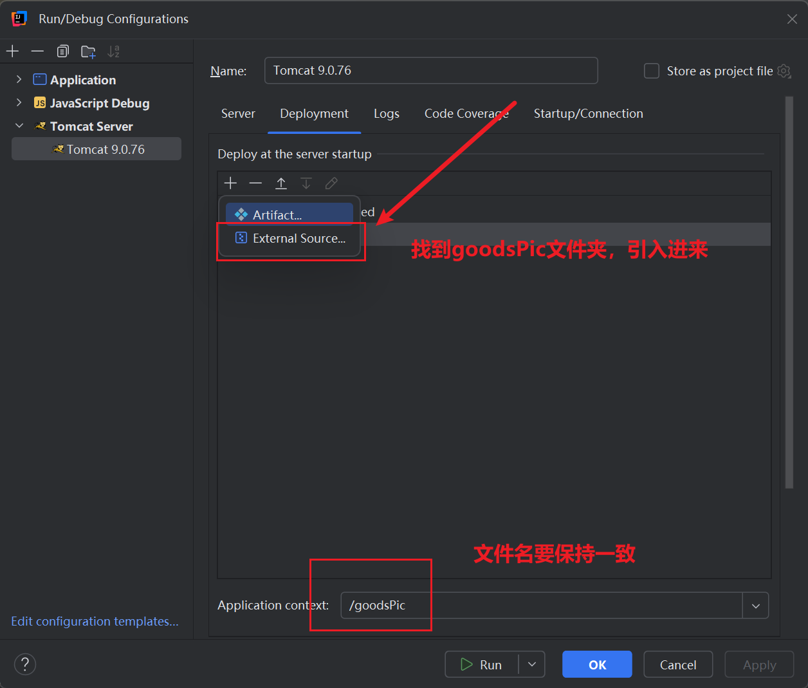
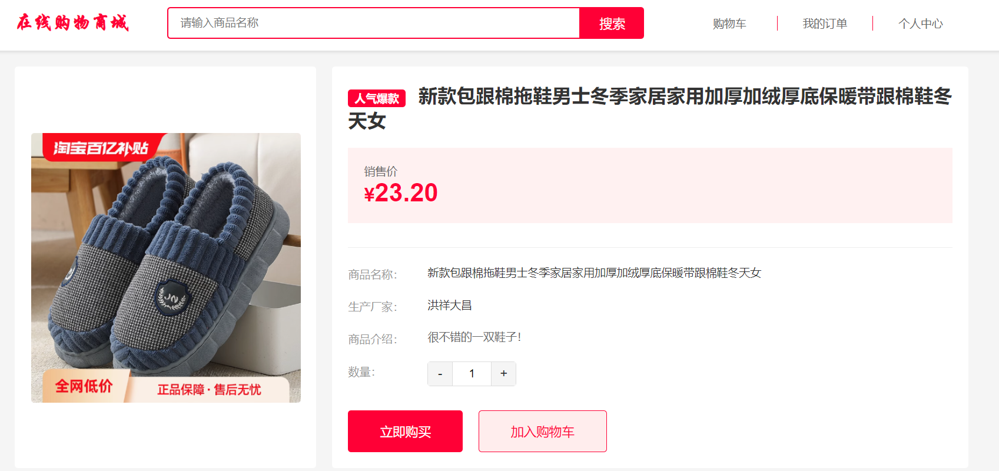
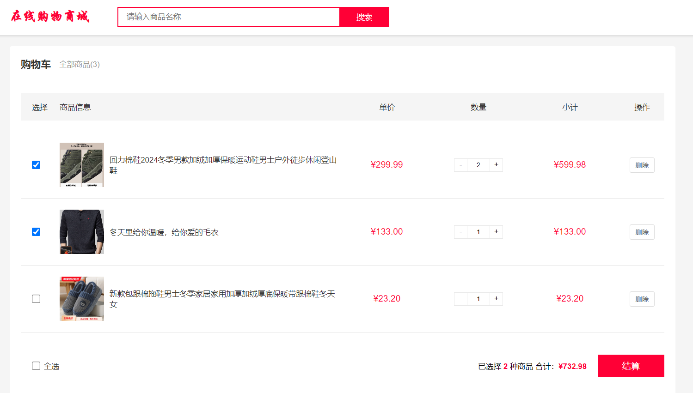

# shopping

#### 介绍
使用javaWeb+mysql 的在线购物商城，可用作课设

 **注意：** 商品的后台管理地址为：http://localhost:8080/houtai/goodsInfo/list,
            文件夹中的goodsPic是存储的商品图片，请不要忘了手动引入（因为我引入的地方，大都你们都没有，建议自己通过外部资源手动引入）
就是这个： 
#### 软件架构
软件架构说明

